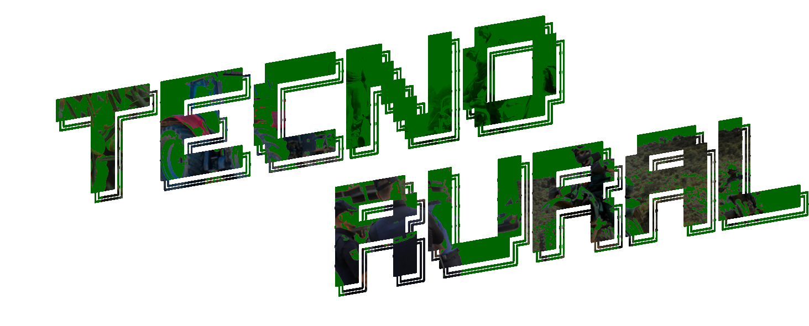
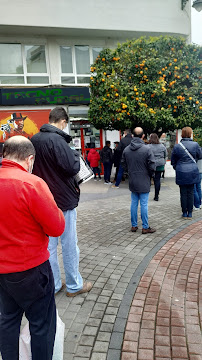
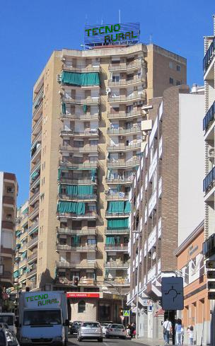

# TecnoRural - Proyecto de Servicios en Red

**Autor:** Ricardo Frutos Bravo  
**Empresa:** TecnoRural S.L. - Cadena de tiendas de informatica en Extremadura  
**Sede central:** Merida, Badajoz

---

## Descripcion del proyecto

Infraestructura de red completa para TecnoRural S.L., desplegada con Vagrant + VirtualBox sobre Debian 12 (bookworm). Incluye balanceo de carga, almacenamiento NFS compartido, base de datos MariaDB y una aplicacion web PHP con Bootstrap 5.

---

## Apertura de la primera tienda - Merida 2026

En enero de 2026 Ricardo abrio su primera tienda en **Merida, Extremadura**. Desde primera hora de la manana se formo una cola de vecinos esperando para entrar, lo que demostro que la idea de Ricardo tenia mucho sentido: en la zona no habia ninguna tienda de informatica cercana y la gente llevaba anos necesitando este servicio.

La tienda de Merida fue la primera de la cadena en ofrecer tambien servicio tecnico presencial, con un mostrador de recepcion de equipos para reparacion. El dia de la apertura se vendieron mas de 40 equipos y se abrieron las primeras incidencias tecnicas en el sistema.

Esta primera tienda en Merida se convirtio rapidamente en la mas importante de la cadena y fue la razon por la que Ricardo decidio instalar aqui la sede central de TecnoRural.

---

## La Torre TecnoRural - Sede Central en Merida

En 2026, con el exito de la primera tienda y la expansion de la cadena por toda Extremadura, Ricardo tomo la decision de establecer la **sede central de TecnoRural** en un edificio emblematico del centro de Merida. El letrero verde de TECNO RURAL en lo alto de la torre se convirtio rapidamente en un simbolo reconocible de la ciudad.

El edificio alberga en su planta baja la tienda mas grande de la cadena, con todos los productos expuestos y el mostrador de atencion tecnica. En las plantas superiores se encuentran las oficinas de administracion, la sala de servidores donde esta alojada toda la infraestructura informatica de la empresa, y una sala de reuniones desde la que se coordina la logistica de las demas tiendas.

Desde la Torre TecnoRural en Merida se gestiona:

- Los pedidos a proveedores para todas las tiendas de la cadena
- Las incidencias tecnicas que llegan a traves de la aplicacion web
- La contabilidad y administracion central
- La ruta semanal de reparto de stock a las tiendas de los pueblos de alrededor
- El equipo de tecnicos que dan soporte a toda Extremadura

La sede en Merida fue posible gracias al crecimiento rapido de la empresa y a la confianza que los vecinos de Extremadura depositaron en TecnoRural desde el primer dia.

---

# TecnoRural - Infraestructura de Servicios

## Responsable

Ricardo Frutos

---

# GLPI 11

**Dirección IP:** `192.168.56.10`

### Funciones

* Gestión de incidencias y solicitudes de soporte.
* Inventario de equipos y activos informáticos.
* Seguimiento de tickets y tareas técnicas.
* Gestión documental.
* Centralización de la información informática de la empresa.

---

# MeshCentral (RMM)

**Dirección IP:** `192.168.56.20`

### Funciones

* Acceso remoto seguro a los equipos de la empresa.
* Soporte técnico remoto.
* Administración de dispositivos.
* Inventario de equipos.
* Monitorización y mantenimiento de sistemas.
* Gestión centralizada de ordenadores del dominio.

---

# Balanceador de Carga en la Nube

### Descripción

Debido a las limitaciones presupuestarias actuales de la empresa, no resulta viable aumentar los recursos hardware (RAM y CPU) de los servidores principales. Como medida para mejorar la disponibilidad y el rendimiento de los servicios sin incrementar significativamente los costes, se ha optado por desplegar dos máquinas virtuales en un proveedor de hosting cloud y situar un balanceador de carga delante de ellas.

### Funciones

* Distribuir las peticiones entre dos servidores.
* Evitar la sobrecarga de una única máquina.
* Mejorar la disponibilidad de los servicios.
* Mantener el servicio operativo si uno de los nodos presenta incidencias.
* Aprovechar recursos de bajo coste en lugar de ampliar servidores con más memoria RAM.

### Infraestructura

El balanceador reparte las conexiones entre dos servidores alojados en la nube:

| Nodo    | Función                     |
| ------- | --------------------------- |
| Cloud 1 | Nodo principal              |
| Cloud 2 | Nodo de apoyo y redundancia |

### Ventajas de esta solución

* Menor coste que ampliar la infraestructura física.
* Mayor disponibilidad del servicio.
* Posibilidad de mantenimiento sin interrupciones.
* Escalabilidad futura mediante la incorporación de nuevos nodos.
* Optimización de los recursos disponibles de la empresa.

---

# Resumen de Direcciones

| Servicio          | Dirección IP  |
| ----------------- | ------------- |
| GLPI 11           | 192.168.56.10 |
| MeshCentral (RMM) | 192.168.56.20 |
